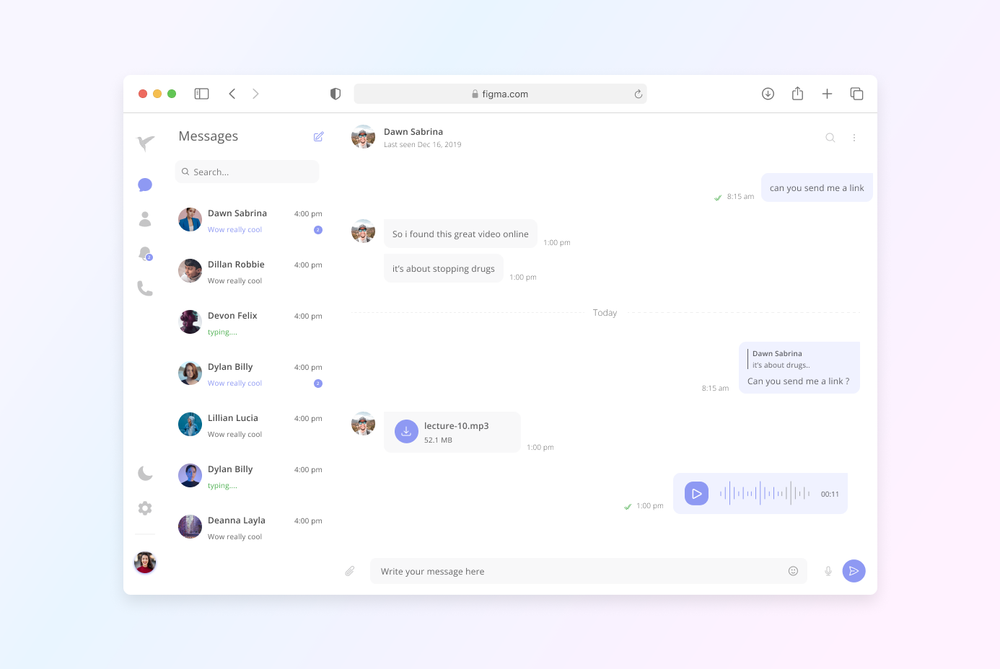

<br />
<div align="center">
  <a href="https://github.com/anarsafar/avian-client">
    
  </a>

  <h2 align="center">Avian Messaging</h2>

  <p align="center">
    A modern chat application designed to streamline communication among users.
    <br />
    <a href="https://app.avian.anarsafarov.xyz">View Demo</a>
    ·
    <a href="https://github.com/anarsafar/avian-client/issues">Report Bug</a>
    ·
    <a href="https://github.com/anarsafar/avian-client/issues">Request Feature</a>
  </p>
</div>

<div align="center">
    
</div>

Avian Messaging is a sophisticated chat application meticulously crafted to facilitate seamless communication while prioritizing security and user privacy.

### Authentication and Authorization

Avian Messaging offers a robust authentication and authorization system, allowing users to securely sign up and sign in using their email credentials. With features like email verification and password recovery, users can trust in the reliability of their account access. Additionally, integration with popular Single Sign-On (SSO) providers such as Facebook, Google, and GitHub offers users convenient and secure alternatives for authentication. The application ensures password security by securely hashing passwords and employs a token-based authentication system with access and refresh tokens. Access tokens, which have a limited lifespan of five hours, are refreshed using refresh tokens, maintaining continuous access to the application. Blacklisting expired tokens adds an extra layer of security to safeguard user accounts.

## Key Features

Avian Messaging offers a myriad of features to enrich the user experience:

- **Profile Customization**: Users have the flexibility to personalize their profiles by changing their usernames, names, and profile pictures, with changes reflecting instantly across the application.
- **Contacts Management**: Users can effortlessly add contacts, send messages, and receive notifications in real-time, ensuring seamless communication.
- **Notification Controls**: Granular notification controls allow users to toggle notifications on or off globally or per user, providing a tailored communication experience.
- **Conversation Management**: Users can filter conversations, search messages, and enjoy infinite loading of messages within chats for a seamless communication experience.
- **Security Features**: Avian Messaging empowers users with the ability to delete contacts or conversations and change passwords at their convenience, ensuring control over their account security.
- **Real-time Features**: Features such as typing indicators, last login timestamps, and online status indicators provide real-time insights into users' activities, enhancing the overall user experience.
- **Theme Customization**: Users can personalize their visual experience by toggling between dark mode and light mode themes, catering to individual preferences.
- **Activity Notifications**: Avian Messaging keeps users informed about significant account activities, including login details and profile changes, fostering transparency and security.
- **Connection Management**: With server delivery and connection state recovery features, Avian Messaging ensures reliable message delivery and seamless user experience, even in challenging network conditions.
- **Visual Enhancements**: Users can view avatars and benefit from network indicators, ensuring a visually rich and user-friendly communication environment.

### Used Technologies

- React
- TypeScript
- React Query
- Zustand
- Zod
- OneSignal
- Socket.IO
- Chakra UI
- Lightbox
- React Router DOM
- React Custom Scrollbars
- React Helmet
- Axios
- React Hook Form
- react-intersection-observer
- and many more...

## Getting Started

To get started you need node.js and pnpm installed on your machine.

- installation

  ```sh
  git clone https://github.com/anarsafar/avian-client
  cd avian-client

  ```

- add env file - Before starting check `.env.example` file and add _server url_ and _socket url_. For more information [avian-server](https://github.com/anarsafar/avian-server).
- You also need geolocation API key generate new one here [BigDataCloud](https://www.bigdatacloud.com/)

- usage

  ```sh
  pnpm add
  pnpm dev
  ```

## Roadmap

This secton contains future updates that I would Like to add

- [ ] Reply to a message
- [ ] send an image
- [ ] group chat
- [ ] push notifications

## Bugs

- [x] Some user on Firefox may expierence issues when try to login using social SSO's. This is because firefox blocks thirdy party cookies by default.
- [x] internet connection indicator issue - indicator may not work as expected

## Contact

Anar Safarov - anarsferov@gmail.com
